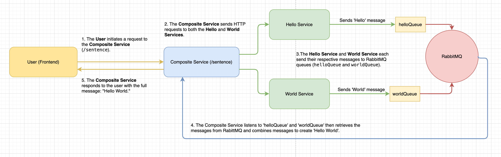

# Hello World Microservices with RabbitMQ 🐇🌐

Welcome to the **Hello World Microservices** project! 🎉 This is a simple example of how you can build microservices using **Spring Boot** and communicate between them using **RabbitMQ**. You'll see how different services can talk to each other in a fun, asynchronous way.

## What's in the box? 📦

This project contains three microservices:

- **Hello Service**: Sends a friendly "Hello" message.
- **World Service**: Sends the second half, "World".
- **Composite Service**: Puts the two together and gives you "Hello World"! 🌍

And they all communicate through **RabbitMQ**, which acts like the postal service for our messages!

## Technologies 🛠️

Here are the key technologies we’re using to build this:

- **Java 17**: Our programming language.
- **Spring Boot**: To quickly spin up each microservice.
- 
- **RabbitMQ**: Our message broker for sending and receiving messages between services.
- **Spring AMQP**: Makes working with RabbitMQ in Spring super easy.
- 
- **Docker**: For running RabbitMQ without a local installation.
- **Maven**: Our build tool to manage dependencies and run services.

## Getting Started 🚀

### 1. Prerequisites ✅

Make sure you have the following installed:

- **Java 17** (because we love it! 🌱)
- **Maven** (so we can build and run the project)
- **RabbitMQ** (either installed locally or through Docker)

### 2. Running RabbitMQ with Docker 🐳

If you don’t have RabbitMQ installed, no worries! Just run it in Docker:

```bash
docker run -d --name rabbitmq -p 5672:5672 -p 15672:15672 rabbitmq:3-management
```

Once it's running, you can visit the RabbitMQ Management UI at [http://localhost:15672](http://localhost:15672) (login: `guest` / `guest`). Easy peasy! 🍋

### 3. Cloning the Project 🧑‍💻

First, clone this repo to your local machine:

```bash
git clone https://github.com/your-username/hello-world-microservices.git
cd hello-world-microservices
```

### 4. Configuring RabbitMQ 📝

Make sure all services know how to find RabbitMQ by adding these lines to each service’s `application.properties` file (in `src/main/resources/`):

```properties
spring.rabbitmq.host=localhost
spring.rabbitmq.port=5672
spring.rabbitmq.username=guest
spring.rabbitmq.password=guest
```

### 5. Building and Running Each Service 🔨

Each service lives in its own directory. Let’s run them one by one!

1. **Hello Service** (running on port 8081):

```bash
cd hello-service
mvn clean install
mvn spring-boot:run
```

2. **World Service** (running on port 8082):

```bash
cd ../world-service
mvn clean install
mvn spring-boot:run
```

3. **Composite Service** (running on port 8080):

```bash
cd ../composite-service
mvn clean install
mvn spring-boot:run
```

### 6. Testing the Services 🧪

With all the services up and running, let's test how they work:

- **Send the "Hello" message** by visiting:
  ```bash
  http://localhost:8081/sendHello
  ```

- **Send the "World" message** by visiting:
  ```bash
  http://localhost:8082/sendWorld
  ```

- **Get the full sentence** from the Composite Service by visiting:
  ```bash
  http://localhost:8080/sentence
  ```

If everything works smoothly, you should see:

```
Hello World
```

But if the messages haven't arrived yet, the Composite Service might say:

```
Waiting for messages...
```

Patience, my friend! The messages will arrive shortly. 😉

### 7. Stopping RabbitMQ 🛑

If you used Docker, you can stop RabbitMQ with this command:

```bash
docker stop rabbitmq
```

That's it! 🎉 You've now got a working microservice system with RabbitMQ.

## Troubleshooting 🛠️

- **Can't see messages?** Make sure RabbitMQ is running and your services are connected to the correct queues.
- **Still seeing "Waiting for messages..."?** Double-check that the Hello and World services are sending messages and that the Composite Service is listening to the correct queues.


### Useful Links 🌐

- [Spring Boot Documentation](https://spring.io/projects/spring-boot)
- [RabbitMQ Documentation](https://www.rabbitmq.com/documentation.html)
- [Spring AMQP Documentation](https://spring.io/projects/spring-amqp)

Thanks for checking out the project! 🚀 If you run into any issues or have questions, feel free to reach out. Enjoy building! 😊

## Author

Made by Michal Frost

